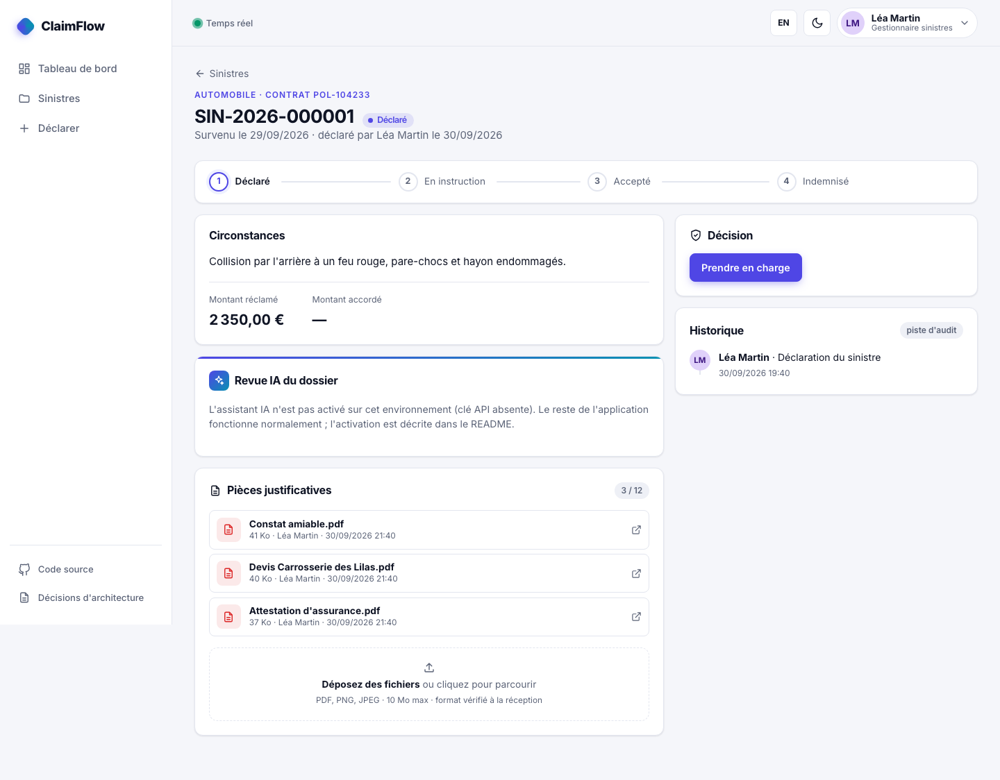
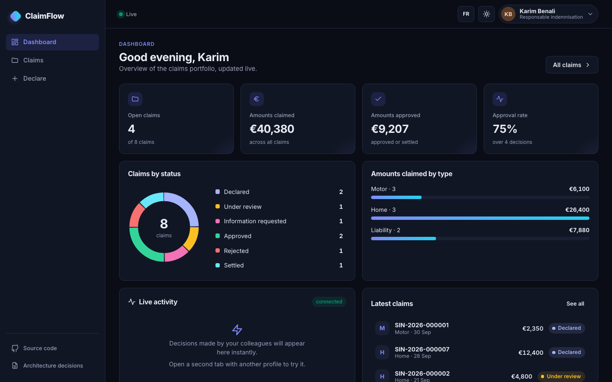
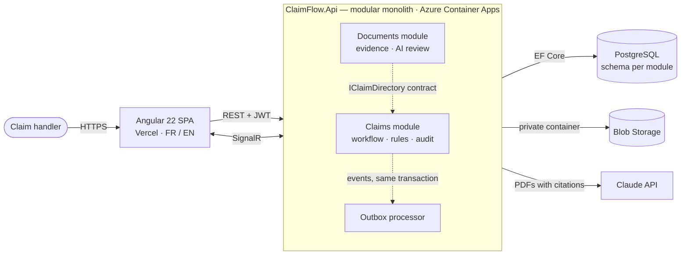
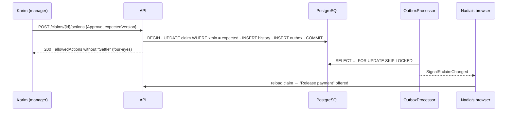

<div align="center">

# ClaimFlow

**Insurance claims handling — .NET 10 · Angular 22 · PostgreSQL · Azure · Claude**

Declare, review, approve and settle insurance claims, with the safeguards of a regulated business
and an AI reviewer that backs every finding with a quoted page.

[**▶ Live demo**](https://claimflow-insurance.vercel.app) · [Architecture decisions](docs/adr/README.md) · [Performance](docs/performance.md) · [Français](#-en-français)

[](https://github.com/JASSBR/claimflow/actions/workflows/ci.yml)
[](https://github.com/JASSBR/claimflow/actions/workflows/codeql.yml)


[](LICENSE)


<table>
  <tr>
    <td width="50%"></td>
    <td width="50%"></td>
  </tr>
  <tr>
    <td align="center"><sub>Claim file: workflow, evidence, AI review, decision rules, audit trail</sub></td>
    <td align="center"><sub>English build, dark theme</sub></td>
  </tr>
</table>

</div>

## Try it in 3 minutes

1. Open the [live demo](https://claimflow-insurance.vercel.app) and pick **Léa Martin** (claims handler). No password: personas are the demo.
2. Open claim **SIN-2026-000001** (the car collision). Three PDFs are attached: a joint accident report, a body-shop
   quote, an insurance certificate. Click **Review the file**: the AI points out that the report describes a *front*
   impact on a roundabout while the declaration says *rear-end at a red light*, and that the quote exceeds the claimed
   amount — every statement links to the exact page it comes from.
3. Take the claim into review and try to approve **25 000 €**: refused, it is above Léa's delegated authority.
4. Open a second browser window as **Karim Benali** (manager) next to **Nadia Haddad**. Karim approves; Nadia's dashboard
   shows it instantly. Karim cannot release the payment he approved himself (*four-eyes principle*) — Nadia can.
5. Log in as **Sophie Laurent** (auditor): everything is visible, nothing is editable.

> The demo API runs on a single small container: the very first request after a quiet period can take a few seconds.

## What a reviewer should look at

| If you care about… | Look at |
|---|---|
| **Domain modelling** | [`Claim.cs`](src/Modules/Claims/ClaimFlow.Claims.Domain/Claim.cs): the workflow is one table; delegated authority, four-eyes and the 2-year time bar (L114-1) are *domain* rules |
| **Reliability** | [Transactional outbox](src/ClaimFlow.BuildingBlocks/Outbox): state and event commit together, `FOR UPDATE SKIP LOCKED`, poison messages parked — [ADR 0002](docs/adr/0002-transactional-outbox.md) |
| **Concurrency** | `xmin` optimistic concurrency → 409 and a UI that reloads the fresh version — [ADR 0003](docs/adr/0003-postgresql-optimistic-concurrency.md) |
| **Architecture** | Modular monolith (Claims, Documents) talking through contracts only, **enforced by tests** — [ADR 0001](docs/adr/0001-modular-monolith.md) |
| **Security** | JWT/OIDC with module-owned policies, content-sniffed uploads, per-user AI budget, prompt-injection guard — [SECURITY.md](SECURITY.md) |
| **AI engineering** | One long-context call with native PDF citations instead of a RAG pipeline; advisory only, stored for audit — [ADR 0009](docs/adr/0009-ai-file-review-with-citations.md) |
| **Modern Angular** | Zoneless, signals, `httpResource`, Signal Forms, realtime as a signal, compiled FR/EN builds — [ADR 0007](docs/adr/0007-frontend-signals-server-driven-workflow.md) |
| **Testing** | Integration tests on real PostgreSQL + Azurite (Testcontainers), architecture tests, Playwright across two live browsers |
| **Performance** | p95 **3.6 ms** reads / **5.6 ms** writes under 50 users; **4 344 req/s** on 2 vCPU with 0 errors — [measured](docs/performance.md) |

## Architecture





```
src/
  ClaimFlow.AppHost/              .NET Aspire: PostgreSQL + Azurite + API + Angular, one command
  ClaimFlow.Api/                  composition root: auth, CORS, rate limiting, security headers, problem details
  ClaimFlow.SharedKernel/         Result, Error, Actor, AggregateRoot — zero dependencies
  ClaimFlow.BuildingBlocks/       outbox, problem-details mapping, principal → actor
  Modules/Claims/                 Domain (pure) · Features (one file per endpoint) · Persistence · Realtime · Contracts
  Modules/Documents/              Domain (pure) · uploads · Blob storage · AI review · demo PDF generation
tests/                            unit · architecture · integration (Testcontainers) · k6 load
web/                              Angular 22 SPA, Vitest unit tests, Playwright e2e
docs/adr/                         9 architecture decision records
deploy/                           Azure + Vercel deployment scripts
```

## Run it locally

Prerequisites: .NET SDK 10, Node 24 (`nvm use`), Docker.

```bash
cd web && npm ci && cd ..
dotnet run --project src/ClaimFlow.AppHost
```

The Aspire dashboard link printed in the console starts and wires everything: PostgreSQL and Azurite in containers,
the API (migrated and seeded, including generated PDF evidence) and the Angular dev server — with logs, traces and
metrics. Open the `web` endpoint. English UI: `cd web && npm run start:en`.

To enable the AI review, set your key once: `dotnet user-secrets set ANTHROPIC_API_KEY <key> --project src/ClaimFlow.AppHost`.

## Quality gates

Every push runs [CI](.github/workflows/ci.yml) and [CodeQL](.github/workflows/codeql.yml):

| Gate | |
|---|---|
| Build | analyzers (Meziantou, Sonar, CA) with warnings as errors, `dotnet format --verify-no-changes`, Prettier, ESLint (OnPush enforced) |
| Backend tests | **99** — domain, architecture (mutation-checked), integration on real PostgreSQL + Azurite, **90 %** line coverage, gate at 80 % |
| Frontend tests | **49** Vitest tests, **92 %** line coverage, thresholds enforced |
| End-to-end | **6** Playwright scenarios on the full stack, including two live browsers |
| Supply chain | vulnerable NuGet/npm packages fail the build, Dependabot, CodeQL |
| Delivery | API container image, EF Core migration bundle artifact |

## Decisions worth discussing

The [ADRs](docs/adr/README.md) record the trade-offs, including where common advice was deliberately **not** followed:
no repository over `DbContext` ([0004](docs/adr/0004-no-repository-over-dbcontext.md)), no `ApiResponse<T>` envelope
([0005](docs/adr/0005-result-pattern-problem-details.md)), no vector database for the AI feature
([0009](docs/adr/0009-ai-file-review-with-citations.md)).

## How it was built

With Claude Code and the [ECC](https://github.com/affaan-m/ECC) agent harness: C#/Angular rules, the `csharp-reviewer`
agent, TDD and verification loops, and project hooks that format every edit and refuse to stop on a red build
([`.claude/`](.claude)). The reviewer and the test suites found real defects before release — claim-number collisions,
a handler timeout able to stop the host, a rate limiter collapsing behind a proxy, per-user AI budgets silently shared
by everyone, a realtime refresh tearing down open forms — each fixed with a regression test that fails on the old code.

## 🇫🇷 En français

ClaimFlow est une application de gestion de sinistres d'assurance : déclaration, instruction, décision, indemnisation.
Elle met en œuvre des règles métier réelles (délégation de pouvoir, principe des quatre yeux, prescription biennale,
piste d'audit), un temps réel fiable (outbox transactionnelle + SignalR) et une revue de dossier par IA dont chaque
constat cite la page de la pièce source. L'interface est disponible en français et en anglais.
[Essayer la démo](https://claimflow-insurance.vercel.app/fr/).

---

MIT © Yassir Sabbar · All people, insurers and documents in the demo are fictitious.
