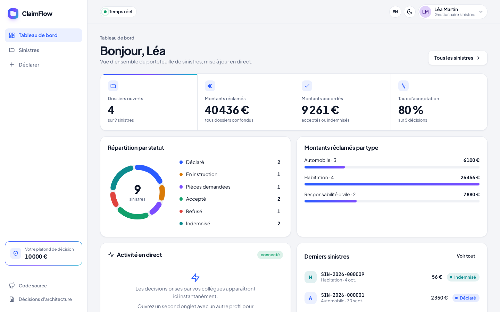
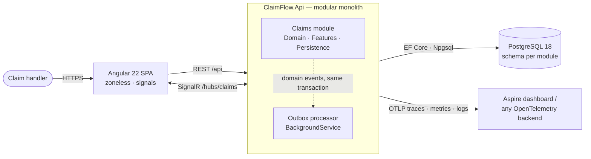
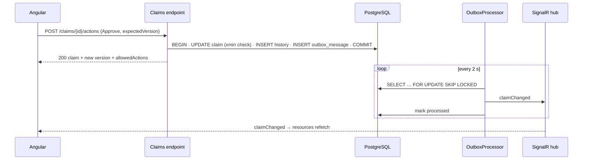

# ClaimFlow

**Insurance claims handling ("gestion de sinistres") — .NET 10 · Angular 22 · PostgreSQL · .NET Aspire**

A claim handler declares a loss, reviews it, requests documents, approves or rejects it, and settles it.
Every dashboard updates live when a colleague makes a decision, and two handlers can never silently overwrite each other.

The business scope is deliberately small; the engineering is production-grade. This repository is meant to be read.



## What to look at (5-minute tour)

| If you care about… | Look at |
|---|---|
| Domain modelling | [`Claim.cs`](src/Modules/Claims/ClaimFlow.Claims.Domain/Claim.cs) — the workflow is one table; invariants include the 2-year time bar (Code des assurances L114-1) |
| Reliability | [Transactional outbox](src/ClaimFlow.BuildingBlocks/Outbox) — events committed atomically with state, `FOR UPDATE SKIP LOCKED`, closed type registry |
| Concurrency | `xmin` optimistic concurrency → `409` + UI reload ([ADR 0003](docs/adr/0003-postgresql-optimistic-concurrency.md)) |
| Architecture | Modular monolith with boundaries **enforced by tests** ([ArchitectureTests](tests/ClaimFlow.ArchitectureTests/ModuleBoundaryTests.cs)) |
| Testing | Integration tests on **real PostgreSQL** (Testcontainers), incl. a SignalR client asserting nothing is pushed before the outbox delivers |
| Modern Angular | Zoneless, `httpResource`, Signal Forms, realtime as a signal, server-driven workflow buttons ([ADR 0007](docs/adr/0007-frontend-signals-server-driven-workflow.md)) |
| Decisions & trade-offs | [7 ADRs](docs/adr/README.md), including two deliberate deviations from common "best practices" |

## Architecture



**Why an outbox?** A state change and the event announcing it must commit together:



```
src/
  ClaimFlow.AppHost/          .NET Aspire: PostgreSQL + API + Angular, one command
  ClaimFlow.ServiceDefaults/  OpenTelemetry, health checks, resilient HTTP
  ClaimFlow.Api/              composition root: ProblemDetails, rate limiting, security headers, OpenAPI
  ClaimFlow.SharedKernel/     Result, Error, AggregateRoot — zero dependencies
  ClaimFlow.BuildingBlocks/   outbox, Result → problem details mapping
  Modules/Claims/
    ClaimFlow.Claims.Domain/  aggregate, workflow, events — no EF, no ASP.NET
    ClaimFlow.Claims/         vertical slices (one file per endpoint), EF config, migrations, SignalR
tests/                        unit · architecture · integration (Testcontainers)
web/                          Angular 22 SPA
docs/adr/                     architecture decision records
```

## Run it

Prerequisites: .NET SDK 10, Node 24 (`nvm use`), Docker.

```bash
cd web && npm ci && cd ..
dotnet run --project src/ClaimFlow.AppHost
```

Open the Aspire dashboard link printed in the console: it starts PostgreSQL in a container, migrates and seeds the
database, starts the API and the Angular dev server, and shows their logs, traces and metrics. Open the `web` endpoint.
In development, the API reference (Scalar) is at `/scalar` on the `api` endpoint.

<details>
<summary>Without Aspire</summary>

```bash
docker run -d --name claimflow-pg -e POSTGRES_PASSWORD=dev -p 5432:5432 postgres:18-alpine
ConnectionStrings__claimflow="Host=localhost;Database=claimflow;Username=postgres;Password=dev" \
  dotnet run --project src/ClaimFlow.Api          # http://localhost:5180
cd web && npm start                                # http://localhost:4200 (proxies /api and /hubs)
```
</details>

## Quality gates

Everything below runs in [CI](.github/workflows/ci.yml) on every push:

```bash
dotnet build ClaimFlow.slnx                       # analyzers (Meziantou, Sonar, CA) — warnings are errors
dotnet format ClaimFlow.slnx --verify-no-changes
dotnet test --solution ClaimFlow.slnx --coverage --coverage-output-format cobertura --coverage-output coverage.cobertura.xml
python3 eng/coverage-gate.py 80                   # ≥ 80 % of production lines
cd web && npm run format:check && npm run lint && npm run test:coverage && npm run build
```

| | Tests | Line coverage |
|---|---|---|
| Backend (domain · architecture · integration) | 53 | 90 % |
| Frontend (Vitest) | 21 | 92 % |

Plus: vulnerable-dependency audit (NuGet + npm), API container image build, EF Core migration bundle artifact.

## Roadmap

- [ ] **Authentication & roles** — OIDC (Keycloak in Aspire locally, Entra ID in Azure); handler vs. expert permissions, approval threshold per role
- [ ] **Documents module + RAG** — attachments in Blob Storage, `pgvector` embeddings, an LLM assistant that summarises the file and flags inconsistencies, with citations
- [ ] **Deployment** — API on Azure Container Apps (migration bundle as a pre-deploy job), SPA on Vercel, public demo with seeded data
- [ ] **Load test** — k6 scenario with published p95 latencies
- [ ] **Playwright** end-to-end suite · **i18n** FR/EN

## Built with an AI-assisted workflow

Built with Claude Code using the [ECC](https://github.com/affaan-m/ECC) agent harness (C#/Angular rules, `csharp-reviewer`,
TDD and verification loops, project hooks in [`.claude/`](.claude)). Every decision is documented in the ADRs and can be
defended line by line — including where the ECC defaults were deliberately **not** followed (ADR 0004, 0005).

The `csharp-reviewer` pass found nine real defects before the first commit — among them claim-number collisions
(32 random bits behind a unique index), a handler timeout able to stop the host through `BackgroundService`, and a
rate limiter collapsing into one bucket behind an ingress proxy. Each fix ships with a regression test that was
verified to fail against the original code.
